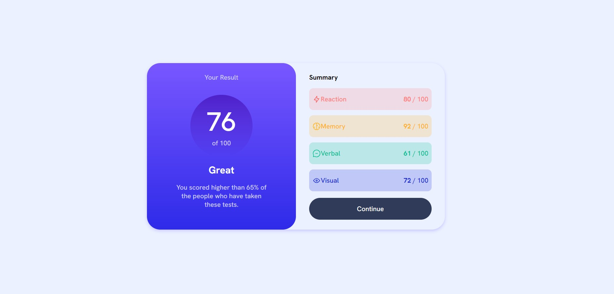

# Frontend Mentor - Results summary component solution

This is a solution to the [Results summary component challenge on Frontend Mentor](https://www.frontendmentor.io/challenges/results-summary-component-CE_K6s0maV). Frontend Mentor challenges help you improve your coding skills by building realistic projects. 

## Table of contents

- [Overview](#overview)
  - [The challenge](#the-challenge)
  - [Screenshot](#screenshot)
  - [Links](#links)
- [My process](#my-process)
  - [Built with](#built-with)
  - [What I learned](#what-i-learned)
  - [Continued development](#continued-development)
  - [Useful resources](#useful-resources)
- [Author](#author)
- [Acknowledgments](#acknowledgments)

## Overview

### The challenge

Users should be able to:

- View the optimal layout for the interface depending on their device's screen size
- See hover and focus states for all interactive elements on the page

### Screenshot

### Links

- Solution URL: 
- Live Site URL: 

## My process

### Built with

- Semantic HTML5 markup
- CSS custom properties
- Flexbox
- CSS Grid

### What I learned

This project is an opportunity to practice my knowledge of HTML5 and CSS.

I was able to use CSS variables (:root) and I was also able to use a tool to minify and compress the CSS, thus decreasing the site's loading time

### Continued development

I plan to add JavaScript in the future so that the site displays information dynamically.

I will continue studying and improving my CSS so that in the future I can add animations to make the site more dynamic

### Useful resources

- [Grid](https://www.origamid.com/projetos/css-grid-layout-guia-completo/) - This article helped me better understand how the display grid works and how its properties work.

## Author

- Frontend Mentor - [@raphaelsiqueiira](https://www.frontendmentor.io/profile/raphaelsiqueiira)
- GitHub - [@raphaelsiqueiira](https://github.com/raphaelsiqueiira)

## Acknowledgments

 - This video helped me clear up some doubts about sizes that I had during the project.
